# Mooncake-Store 多级缓存技术方案

## 一、总述

Mooncake-Store 实现了 **L1 内存缓存 + L2 磁盘缓存** 的两级缓存架构。以内存缓存为主体提供高性能低延迟的数据读写，以磁盘缓存为兜底提供数据持久化与冷数据回退能力。两级缓存通过统一的 `Replica::Descriptor`（`std::variant<MemoryDescriptor, DiskDescriptor>`）对上层透明。

---

## 二、架构全景

### 2.1 系统整体架构

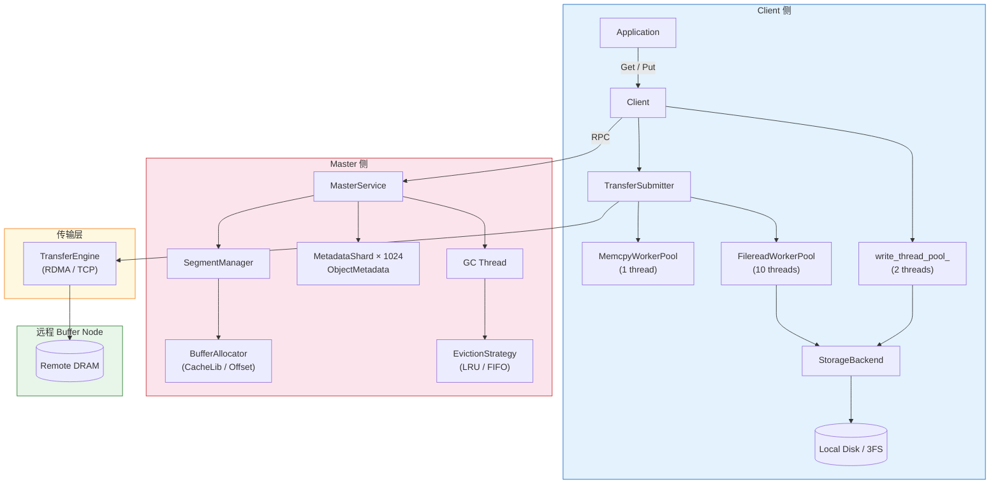

### 2.2 数据结构关系

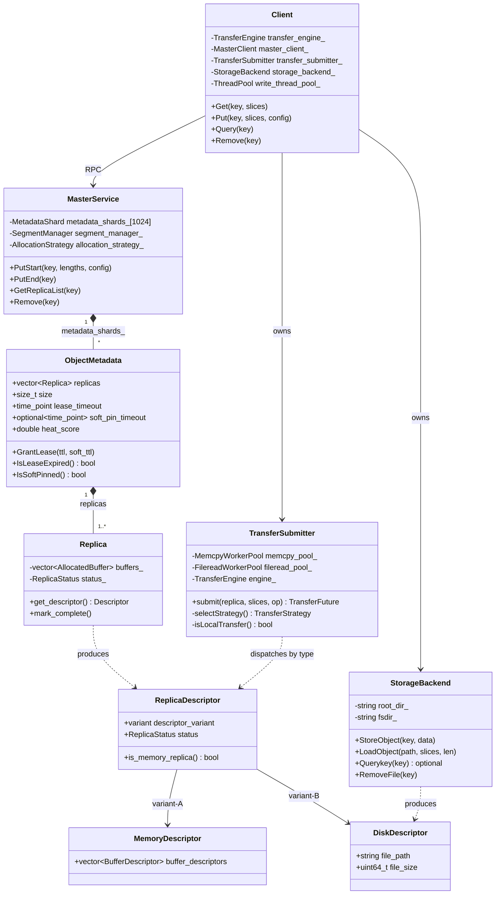

---

## 三、核心流程

### 3.1 Put 操作时序图

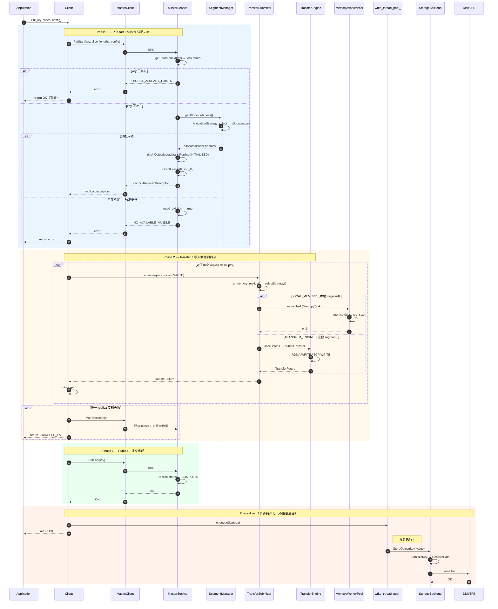

### 3.2 Get 操作时序图

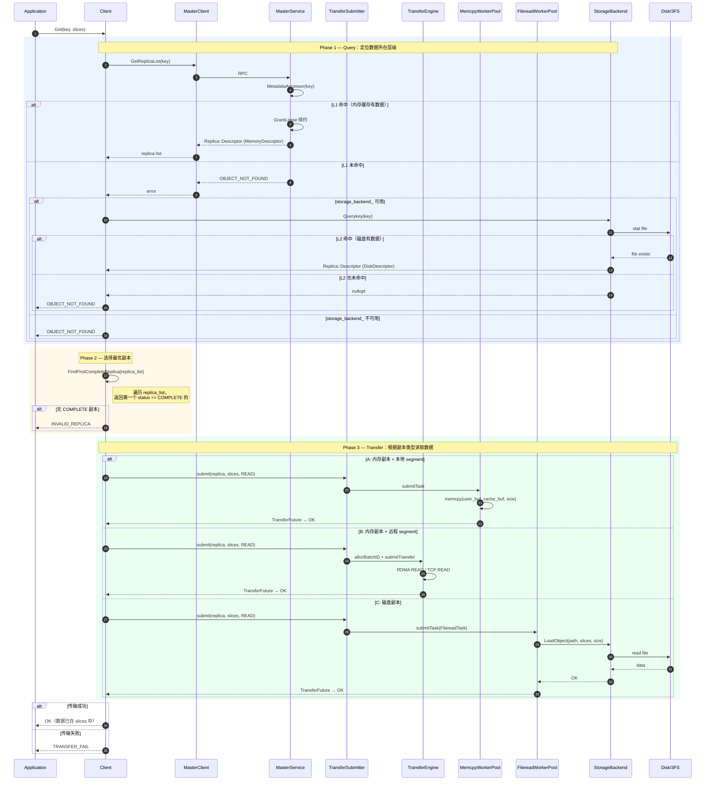

### 3.3 BatchPut 操作时序图

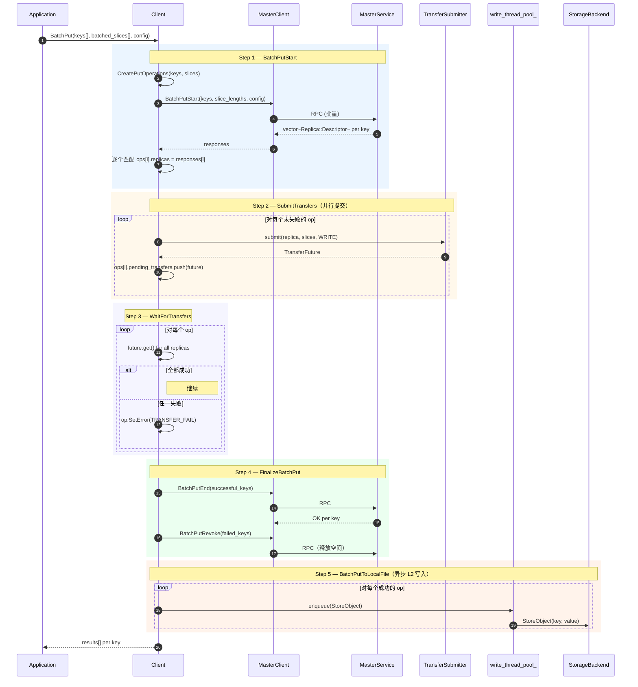

---

## 四、决策与策略

### 4.1 缓存层级选择决策流程

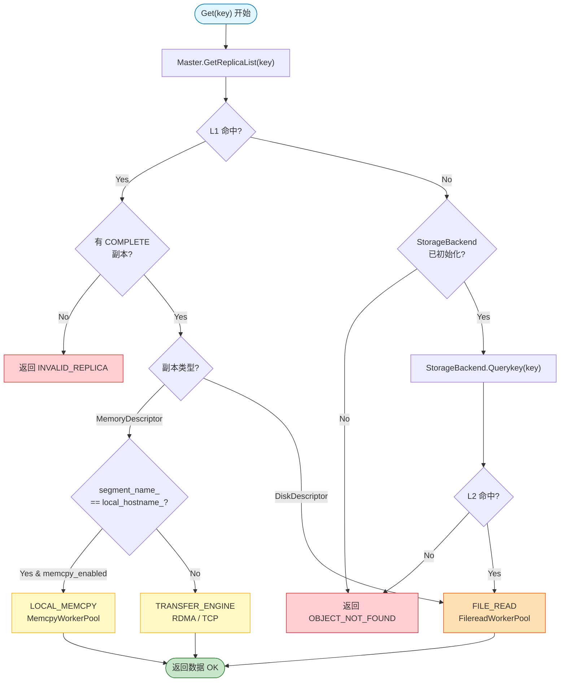

### 4.2 Put 操作中 L1/L2 写入关系

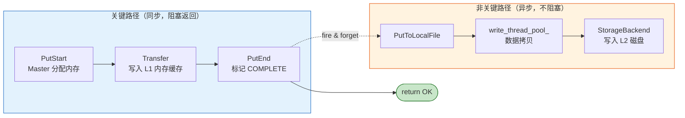

### 4.3 GC / 驱逐策略流程

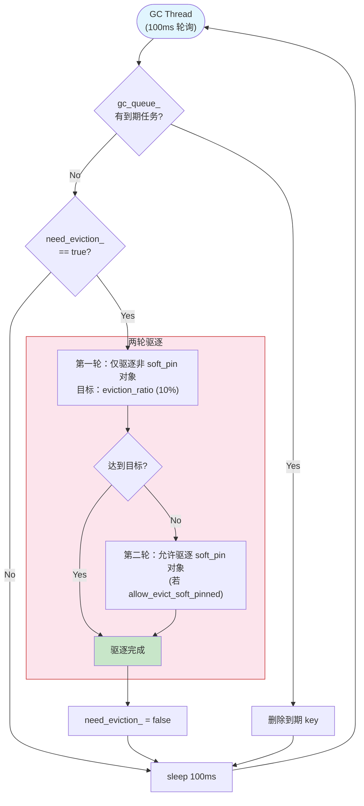

### 4.4 传输策略对比

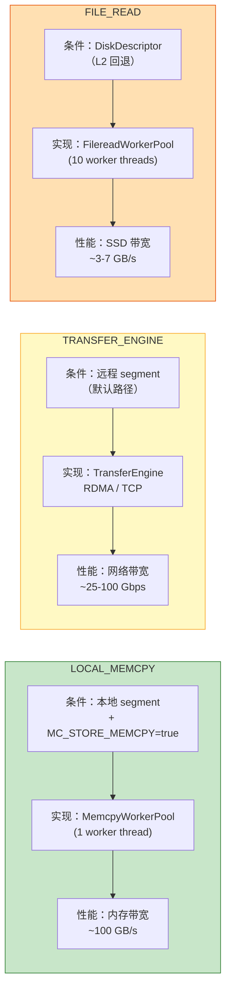

---

## 五、配置与开关

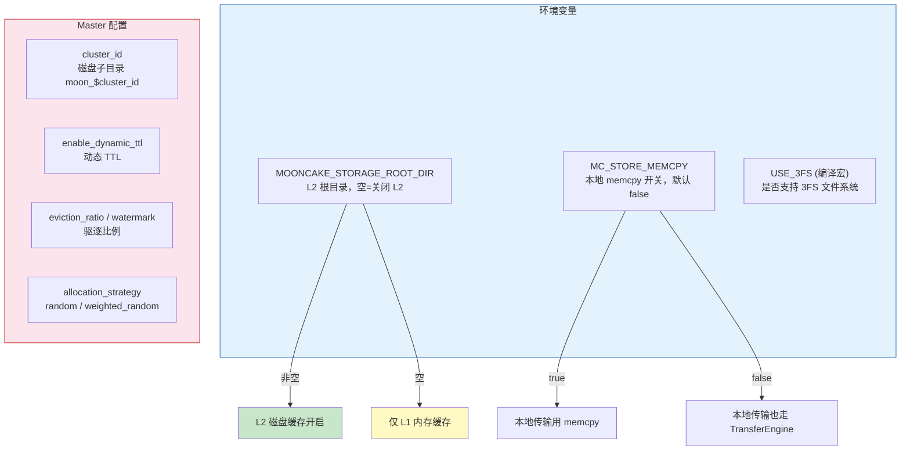

---

## 六、错误处理全景

### 6.1 Put 错误处理

```mermaid
flowchart TD
    PutStart{PutStart 结果} -->|OBJECT_ALREADY_EXISTS| Idempotent["return OK（幂等）"]
    PutStart -->|NO_AVAILABLE_HANDLE| AllocFail["return error<br/>Master 触发驱逐"]
    PutStart -->|OK| Transfer

    Transfer{Transfer 结果} -->|失败| Revoke["PutRevoke(key)"]
    Revoke --> RevokeResult{Revoke 成功?}
    RevokeResult -->|Yes| RetErr1["return TRANSFER_FAIL<br/>空间已释放"]
    RevokeResult -->|No| RetErr2["return error<br/>空间泄漏风险"]
    Transfer -->|成功| PutEnd

    PutEnd{PutEnd 结果} -->|OK| L2Write["异步写 L2"]
    PutEnd -->|失败| RetErr3["return error<br/>Replica 状态不一致"]

    L2Write --> L2Result{L2 写入结果}
    L2Result -->|成功| AllOK(["return OK"])
    L2Result -->|失败| AllOK
    Note right of L2Result: L2 失败不影响返回值<br/>仅丢失持久化副本

    style Idempotent fill:#c8e6c9
    style AllOK fill:#c8e6c9
    style AllocFail fill:#ffcdd2
    style RetErr1 fill:#ffcdd2
    style RetErr2 fill:#ffcdd2
    style RetErr3 fill:#ffcdd2
```

### 6.2 Get 错误处理

```mermaid
flowchart TD
    Query{Query Master} -->|OK| FindReplica
    Query -->|OBJECT_NOT_FOUND| HasSB{StorageBackend?}

    HasSB -->|有| DiskQuery{Querykey(key)}
    HasSB -->|无| Err1["OBJECT_NOT_FOUND"]

    DiskQuery -->|命中| FindReplica
    DiskQuery -->|未命中| Err1

    FindReplica{FindFirstComplete<br/>Replica} -->|找到| DoTransfer
    FindReplica -->|未找到| Err2["INVALID_REPLICA"]

    DoTransfer{Transfer 结果} -->|OK| RetOK(["return OK"])
    DoTransfer -->|失败| Err3["TRANSFER_FAIL"]

    style RetOK fill:#c8e6c9
    style Err1 fill:#ffcdd2
    style Err2 fill:#ffcdd2
    style Err3 fill:#ffcdd2
```

---

## 七、现状评估

### 7.1 数据流向总图

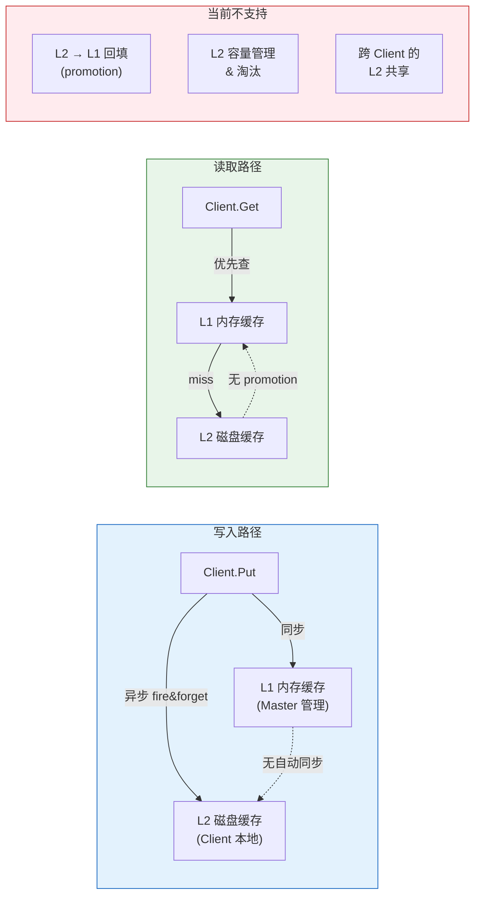

### 7.2 L1 vs L2 特性对比


### 7.3 回退触发条件分析

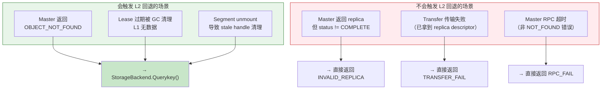
```mermaid
graph TB                                     
      subgraph GPU["GPU VRAM"]
          KV["KVCache Tensor"]                                                                                                                              
      end                                                                                                                                                   
                                                                                                                                                            
      subgraph DRAM["Memory — L1 缓存（Master 集中管理）"]                                                                                                  
          direction LR                                                                                                                                    
          LocalMem["本机 DRAM<br/>Segment"]
          RemoteMem["远程节点 DRAM<br/>Segment"]
      end                                                                                                                                                   
  
      subgraph SSD["SSD — L2 缓存（Client 本地）"]                                                                                                          
          DiskFile["StorageBackend<br/>文件: moon_cluster/&lt;key&gt;"]                                                                                   
      end                                                                                                                                                   
  
      %% ======== Put 路径 ========                                                                                                                         
      KV ==>|"① Put: Client 注册<br/>slices 指向 GPU 内存"| LocalMem                                                                                      
      KV ==>|"② Put: RDMA WRITE<br/>写入远程节点"| RemoteMem
      LocalMem -.->|"③ 异步下沉<br/>write_thread_pool_<br/>(fire & forget)"| DiskFile
      RemoteMem -.->|"③ 异步下沉<br/>Client 侧数据拷贝后写盘"| DiskFile                                                                                     
                                                                                                                                                            
      %% ======== Get 路径 ========                                                                                                                         
      LocalMem ==>|"④ Get 命中 L1<br/>memcpy 直拷"| KV                                                                                                      
      RemoteMem ==>|"⑤ Get 命中 L1<br/>RDMA READ"| KV                                                                                                       
      DiskFile ==>|"⑥ Get L1 miss<br/>回退读盘<br/>FilereadWorkerPool"| KV                                                                                  
                                                                                                                                                            
      %% 样式                                                                                                                                               
      style GPU fill:#c8e6c9,stroke:#2e7d32,stroke-width:2px                                                                                                
      style DRAM fill:#e3f2fd,stroke:#1565c0,stroke-width:2px                                                                                               
      style SSD fill:#fff3e0,stroke:#e65100,stroke-width:2px 
```