# Mooncake Offload 机制详解

本文档详细解读 Mooncake 的 Offload（数据卸载）机制，包括架构设计、核心组件、配置参数和数据流程。

## 1. 概述

Offload 机制是 Mooncake 的核心特性之一，用于将内存中的 KV 缓存数据持久化到本地磁盘，实现以下目标：

- **容量扩展**：突破内存容量限制，支持更大规模的 KV 缓存
- **成本优化**：利用低成本磁盘存储热数据溢出部分
- **数据持久化**：服务重启后可快速恢复缓存状态

## 2. 架构设计

### 2.1 整体架构

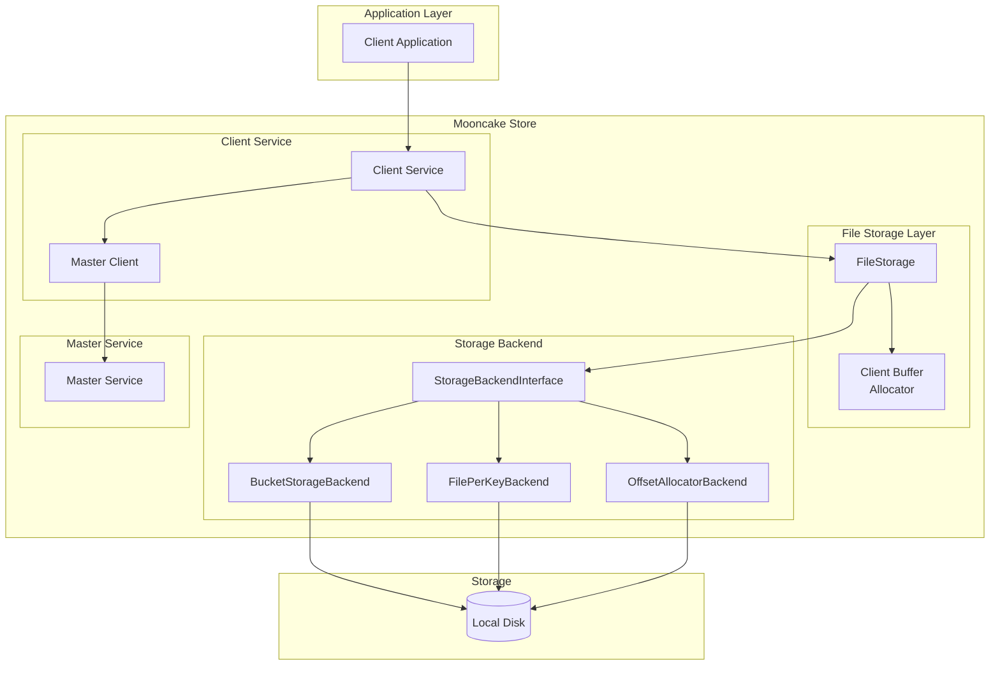

### 2.2 核心组件职责

| 组件 | 职责 |
|-----|------|
| **FileStorage** | 文件存储管理器，协调心跳、数据卸载和加载操作 |
| **StorageBackend** | 存储后端抽象层，提供统一的数据读写接口 |
| **BucketStorageBackend** | 桶存储后端，将多个对象打包成桶存储，提高 I/O 效率 |
| **Client Buffer Allocator** | 客户端缓冲区分配器，管理数据读取时的临时内存 |
| **Master Service** | 元数据管理服务，跟踪对象位置和状态 |

## 3. 存储后端类型

Mooncake 支持三种存储后端，通过 `MOONCAKE_OFFLOAD_STORAGE_BACKEND_DESCRIPTOR` 环境变量配置：

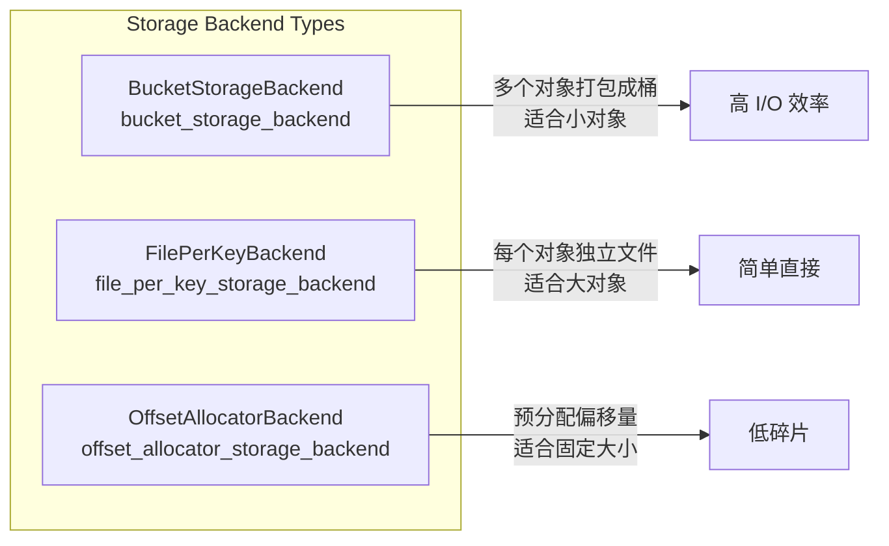

### 3.1 BucketStorageBackend（推荐）

将多个对象打包成一个"桶"（Bucket）进行存储：

- **优势**：减少文件数量，提高小对象存储效率
- **适用场景**：大量小对象的 KV 缓存
- **限制**：单个桶有键数量和大小限制

### 3.2 FilePerKeyBackend

每个对象对应一个独立文件：

- **优势**：实现简单，适合大对象
- **劣势**：大量小文件影响文件系统性能

### 3.3 OffsetAllocatorBackend

使用预分配的偏移量管理存储空间：

- **优势**：减少碎片，空间利用率高
- **适用场景**：对象大小相对固定的场景

## 4. 数据流程

### 4.1 Offload（数据卸载）流程

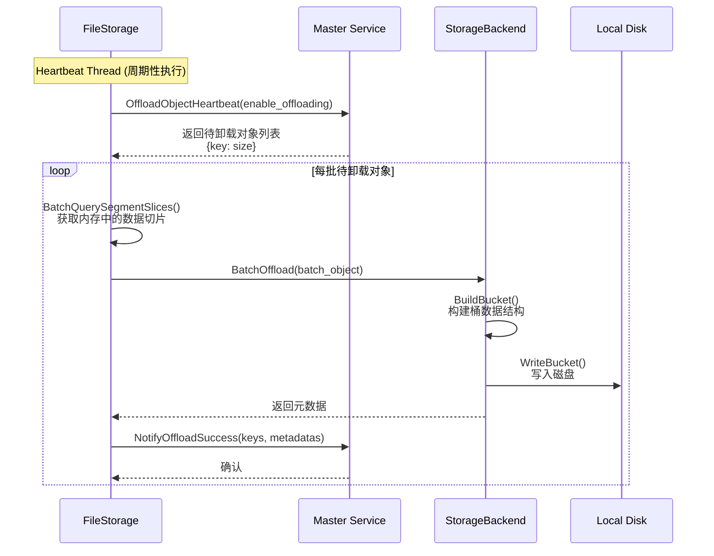

### 4.2 Load（数据加载）流程

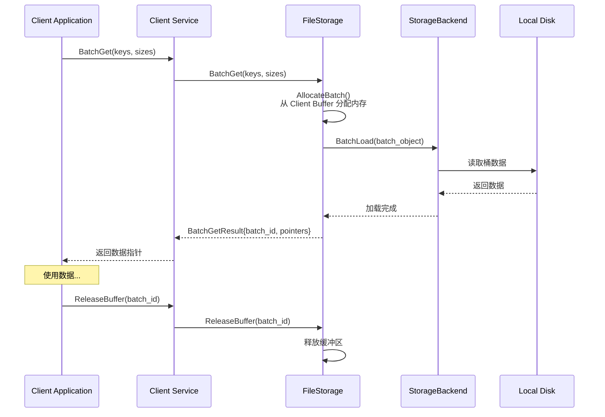

### 4.3 心跳与状态同步

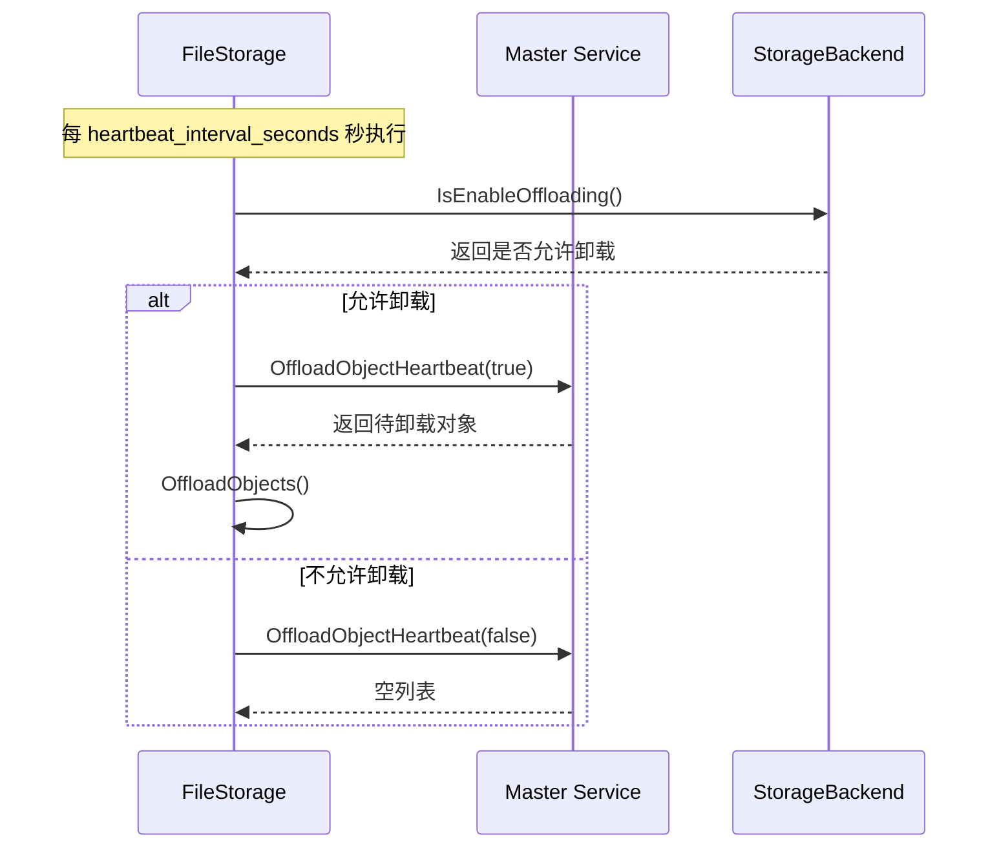

## 5. 配置参数详解

### 5.1 存储后端配置

| 环境变量 | 默认值 | 说明 |
|---------|-------|------|
| `MOONCAKE_OFFLOAD_STORAGE_BACKEND_DESCRIPTOR` | `bucket_storage_backend` | 存储后端类型 |
| `MOONCAKE_OFFLOAD_FILE_STORAGE_PATH` | `/data/file_storage` | 数据存储路径 |
| `MOONCAKE_OFFLOAD_FSDIR` | - | FilePerKey 后端目录名 |

### 5.2 容量限制配置

| 环境变量 | 默认值 | 说明 |
|---------|-------|------|
| `MOONCAKE_OFFLOAD_BUCKET_KEYS_LIMIT` | `500` | 单桶最大键数量 |
| `MOONCAKE_OFFLOAD_BUCKET_SIZE_LIMIT_BYTES` | `256MB` | 单桶最大大小 |
| `MOONCAKE_OFFLOAD_TOTAL_KEYS_LIMIT` | `10,000,000` | 全局最大键数量 |
| `MOONCAKE_OFFLOAD_TOTAL_SIZE_LIMIT_BYTES` | `2TB` | 全局最大存储大小 |

### 5.3 缓冲区配置

| 环境变量 | 默认值 | 说明 |
|---------|-------|------|
| `MOONCAKE_OFFLOAD_LOCAL_BUFFER_SIZE_BYTES` | `~1.2GB` | 本地缓冲区大小 |

### 5.4 心跳与 GC 配置

| 环境变量 | 默认值 | 说明 |
|---------|-------|------|
| `MOONCAKE_OFFLOAD_HEARTBEAT_INTERVAL_SECONDS` | `10` | 心跳间隔（秒） |
| `MOONCAKE_OFFLOAD_CLIENT_BUFFER_GC_INTERVAL_SECONDS` | `1` | 缓冲区 GC 间隔（秒） |
| `MOONCAKE_OFFLOAD_CLIENT_BUFFER_GC_TTL_MS` | `5000` | 缓冲区租约超时（毫秒） |

### 5.5 其他配置

| 环境变量 | 默认值 | 说明 |
|---------|-------|------|
| `MOONCAKE_USE_URING` | `false` | 是否使用 io_uring |
| `MOONCAKE_SCANMETA_ITERATOR_KEYS_LIMIT` | `20000` | 扫描元数据迭代器键限制 |

## 6. 核心数据结构

### 6.1 BucketMetadata

```cpp
struct BucketMetadata {
    int64_t meta_size;           // 元数据大小
    int64_t data_size;           // 数据大小
    std::vector<std::string> keys;           // 键列表
    std::vector<BucketObjectMetadata> metadatas;  // 对象元数据列表
    std::atomic<int32_t> inflight_reads_;    // 正在进行的读操作计数
};
```

### 6.2 BucketObjectMetadata

```cpp
struct BucketObjectMetadata {
    int64_t offset;    // 数据在桶中的偏移量
    int64_t key_size;  // 键大小
    int64_t data_size; // 数据大小
};
```

### 6.3 StorageObjectMetadata

```cpp
struct StorageObjectMetadata {
    int64_t bucket_id;    // 所属桶 ID
    int64_t offset;       // 桶内偏移
    int64_t key_size;     // 键大小
    int64_t data_size;    // 数据大小
    std::string transport_endpoint;  // 传输端点地址
};
```

## 7. 关键机制

### 7.1 桶分组策略

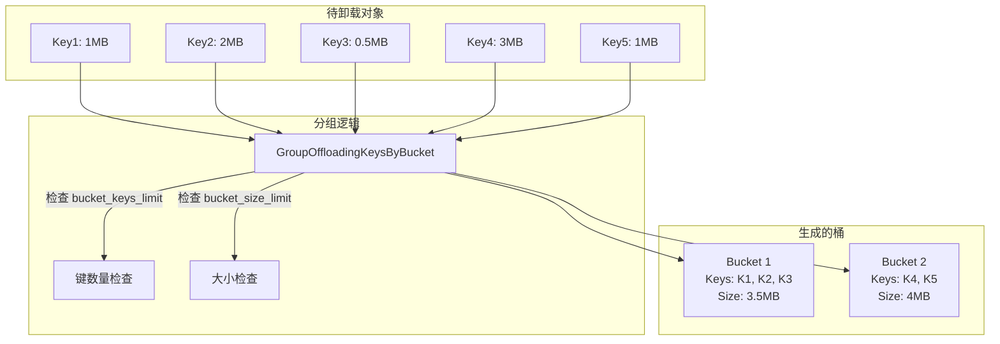

### 7.2 容量控制

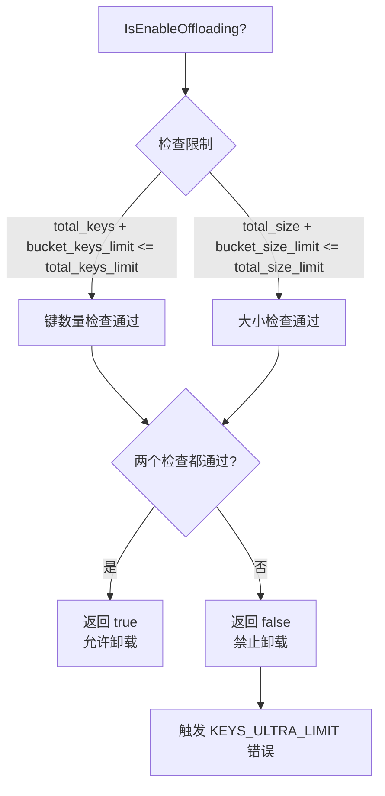

### 7.3 客户端缓冲区管理

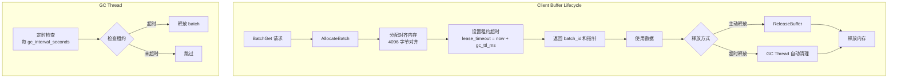

### 7.4 安全读取保护（BucketReadGuard）

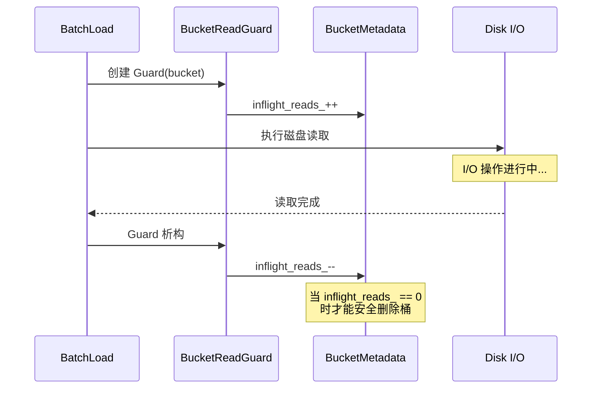

## 8. 初始化流程

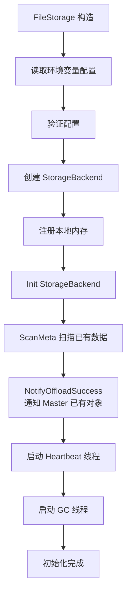

## 9. 错误处理

### 9.1 错误码

| 错误码 | 说明 |
|-------|------|
| `UNABLE_OFFLOAD` | Offload 功能未启用 |
| `UNABLE_OFFLOADING` | 无法执行卸载操作 |
| `KEYS_ULTRA_LIMIT` | 键数量超过全局限制 |
| `KEYS_EXCEED_BUCKET_LIMIT` | 单桶键数量超限 |
| `OBJECT_ALREADY_EXISTS` | 对象已存在（重复键） |
| `OBJECT_NOT_FOUND` | 对象未找到 |
| `BUCKET_NOT_FOUND` | 桶未找到 |

### 9.2 重复键处理

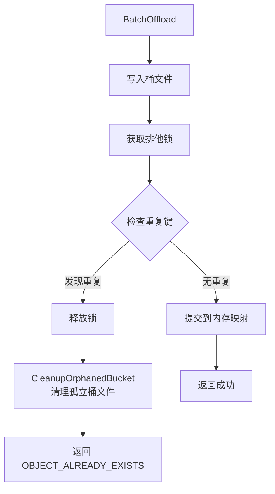

## 10. 性能优化建议

### 10.1 缓冲区大小调优

```
MOONCAKE_OFFLOAD_LOCAL_BUFFER_SIZE_BYTES = 预期并发读取量 × 1.5
```

### 10.2 桶大小调优

```
MOONCAKE_OFFLOAD_BUCKET_KEYS_LIMIT = 根据对象平均大小调整
MOONCAKE_OFFLOAD_BUCKET_SIZE_LIMIT_BYTES = 磁盘顺序写入最佳块大小
```

### 10.3 心跳间隔调优

```
MOONCAKE_OFFLOAD_HEARTBEAT_INTERVAL_SECONDS = 数据变化频率 / 10
```

## 11. 监控指标

建议监控以下关键指标：

- `total_keys`：当前存储的总键数量
- `total_size`：当前存储的总数据大小
- `inflight_reads`：正在进行的读操作数量
- `client_buffer_usage`：客户端缓冲区使用率
- `offload_latency`：卸载操作延迟
- `load_latency`：加载操作延迟
